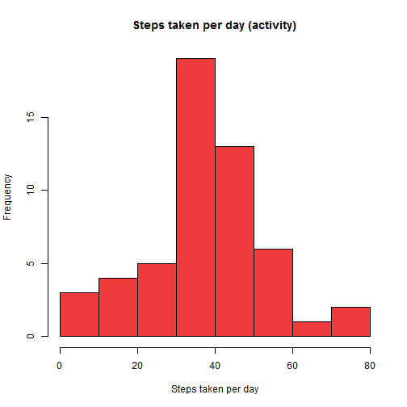
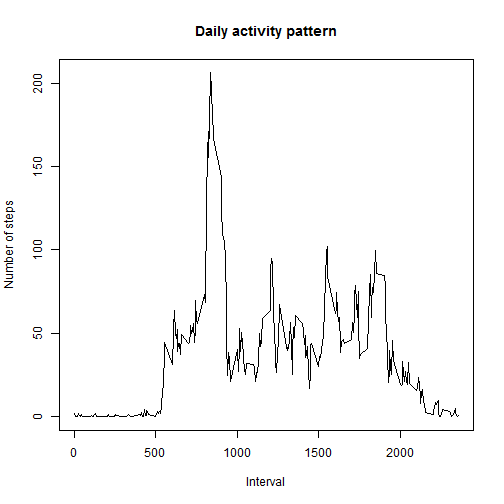
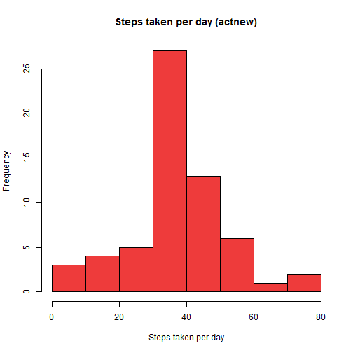

# Reproducible Research: Peer Assessment 1


## Loading and preprocessing the data


```r
setwd(file.path("C:","Users","Monillas","Desktop","Coursera",
                "Reproducible Research"))
activity <- read.csv("activity.csv")
```


## What is mean total number of steps taken per day?


```r
meansteps <- aggregate(activity$steps, list(Date = activity$date), mean)
mean <- mean(meansteps[,2], na.rm=TRUE)
median <- median(meansteps[,2], na.rm=TRUE)
hist(meansteps[,2], col="brown2", xlab="Steps taken per day",
     main="Steps taken per day (activity)")
```

 

The mean total number of steps taken per day is 37.3826 while the median
total number of steps taken per day is 37.3785.


## What is the average daily activity pattern?


```r
dailypattern <- aggregate(activity$steps, list(Int = activity$interval), 
                          mean, na.rm=TRUE)
maxsteps <- dailypattern[which(dailypattern[,2]==max(dailypattern[,2])), 1]
plot(dailypattern[,1], dailypattern[,2], type="l",
     xlab="Interval",
     ylab="Number of steps",
     main="Daily activity pattern")
```

 

The 835th 5-minute interval contains the maximum number of steps.


## Imputing missing values


```r
missing <- sum(is.na(activity$steps))
actnew <- activity
for (i in 1:length(actnew$steps)) {
    if ( is.na(actnew[i,1]) ) {
        int <- actnew[i,3]
        actnew[i,1] <- dailypattern[which(dailypattern[,1]==int), 2]
    }
}
meansteps <- aggregate(as.numeric(actnew$steps), 
                       list(Date = actnew$date), mean)
mean <- mean(meansteps[,2], na.rm=TRUE)
median <- median(meansteps[,2], na.rm=TRUE)
hist(meansteps[,2], col="brown2", xlab="Steps taken per day",
     main="Steps taken per day (actnew)")
```

 

There are 2304 missing values in the 'activity' dataset. A strategy that we can use to get rid of missing values is to fill them in with the mean for their corresponding 5-minute interval. We call this new dataset 'actnew', which turns out to have a mean total number of steps taken per day to be 37.3826 and a median of 37.3826. It looks like the mean of the 'activity' dataset is the same as the mean (and the median) of the 'actnew' dataset. In addition, the median of the 'activity' dataset is not that far off from the median of the 'actnew' dataset. Looking at the two histograms, we can say that imputing missing values lowered the tails and raised the peak of the histogram by reducing the variation in the average steps taken per day. This is mostly due to our strategy, which replaced missing values with average values. Therefore, the total daily number of steps in the 'activity' and 'actnew' datasets shouldn't be drastically different; imputing missing values based on our strategy has managed to keep the new distribution fairly similar to that of the original.


## Are there differences in activity patterns between weekdays and weekends?


```r
actnew$date <- as.Date(actnew$date)
actnew$type <- weekdays(actnew$date)
actnew$type <- ifelse( actnew$type=="Saturday" | actnew$type=="Sunday",
                       "weekend", "weekday")
dailypattern <- aggregate(as.numeric(actnew$steps), 
                          list(Int = actnew$interval, 
                               Type = actnew$type), 
                          mean, na.rm=TRUE)
library(lattice)
dailypattern$Type <- factor(dailypattern$Type)
xyplot( dailypattern$x ~ dailypattern$Int | 
        dailypattern$Type, layout=c(1,2), type="l",
        xlab="Interval", ylab="Number of steps")
```

 
